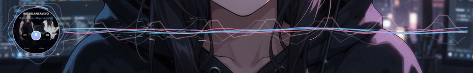
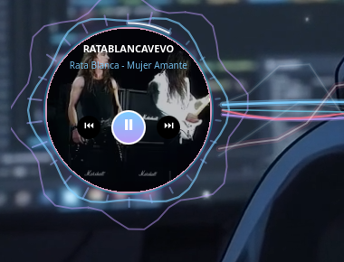
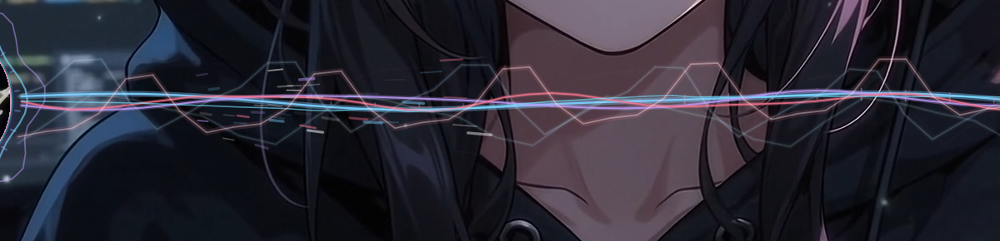
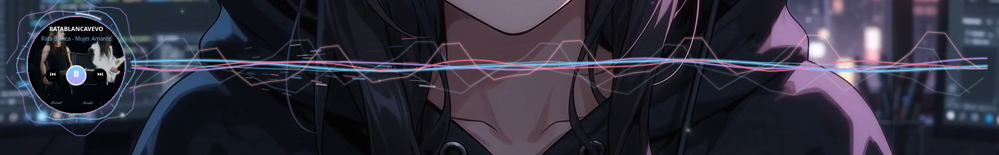

<div align="center">

# 🌊 BurstWave — Plasmoid para KDE Plasma 6
### *Widget multimedia circular con ondas envolventes, anillo de carga cinética y ráfagas eléctricas reactivas al ritmo de la música.*

[](https://kde.org/)
[](https://opensource.org/licenses/MIT)
[](https://github.com/karlstav/cava)
[](https://pipewire.org/)
[](https://archlinux.org/)

<br/>

<div align="center">
  
</div>

<br/>

</div>

---

## 📸 Demostración Visual

| Hub Circular & Controles | Espectro Reactivo & Ondas |
|:---:|:---:|
|  |  |

<div align="center">
  
  <p><em>Vista panorámica inferior en KDE Plasma 6 con reproducción activa y efectos de espectro de audio.</em></p>
  <p>🎬 <strong><a href="assets/burstwave-demo.mp4">Ver Video Demostración (MP4)</a></strong></p>
</div>

---

## ✨ Descripción

**BurstWave** es un plasmoid de última generación para **KDE Plasma 6**, diseñado para los amantes de la música y la personalización estética de Linux. Combina una carátula circular interactiva con controles multimedia integrados y un motor gráfico canvas reactivo alimentado en tiempo real por el espectro de audio de tu sistema.

A diferencia de los visualizadores convencionales que solo dibujan barras verticales, **BurstWave** transforma el sonido en energía visual: proyecta anillos de resonancia alrededor de la portada, una viga de ondas multicolores que fluye por tu pantalla, acumula energía en un anillo de carga perimetral y desata **rayos de plasma y chispas eléctricas** cuando estallan los coros y los drops de tus pistas favoritas.

---

## 🚀 Características Principales

- 💿 **Hub Circular Interactivo**:
  - Renderizado circular de la carátula del álbum en tiempo real mediante shaders de aceleración por hardware (`MultiEffect` mask).
  - Efecto de cristal translúcido (*glassmorphism*) que atenúa sutilmente la portada al pasar el ratón para interactuar cómodamente con los controles.
  - Carátula de respaldo generativa con pulsos armónicos si el reproductor no provee imagen.
- ⚡ **Efectos de Ráfaga Eléctrica & Drops**:
  - Detección algorítmica de ataque sonoro y golpes de bajo.
  - Anillo de acumulación cinética (carga entre 5 y 7 segundos de música continua).
  - Descarga de relámpagos con ramificación fractal, chispas gravitatorias y ondas de choque expansivas en los picos de intensidad.
- 🌊 **Viga Multionda Continua**:
  - Ondas sinusoidales superpuestas que se proyectan hacia la derecha de la pantalla.
  - Transición fluida de color con gradientes dinámicos (Cian eléctrico, Púrpura neón y Rosa de ráfaga).
- 🎛️ **Controles Multimedia Integrados**:
  - Botones táctiles de reproducción: **Play / Pausa**, **Canción Anterior** y **Canción Siguiente**.
  - Visualización clara del título de la pista y nombre del artista en reproducción.
  - Compatible con Spotify, navegadores (YouTube, SoundCloud vía *Plasma Browser Integration*), VLC, Elisa, MPD, etc.
- ⚡ **Rendimiento Extremo & Bajo Consumo**:
  - Canalización de datos de audio ultra rápida mediante `feeder.sh` + `publish.awk` conectado a memoria volátil `$XDG_RUNTIME_DIR`.
  - Pacing dinámico de fotogramas: **60 FPS** fluidos durante la reproducción y modo de reposo automático (**~18 FPS**) cuando la música se detiene para cuidar tu batería y procesador.
- 🛠️ **Configuración Nativa Plasma**:
  - Ajuste en vivo desde la ventana de configuración del plasmoid: número de barras, sensibilidad CAVA, reducción de ruido, tasa de fotogramas y colores.

---

## 📋 Requisitos y Dependencias

Para disfrutar de todas las funciones de BurstWave, asegúrate de tener instalados los siguientes componentes:

| Componente | Paquete | Propósito |
|---|---|---|
| **Entorno de Escritorio** | KDE Plasma 6 (`plasma-workspace`) | Base para ejecutar el plasmoid |
| **Visualizador de Audio** | `cava` | Generación del espectro de audio por terminal |
| **Servidor de Audio** | `pipewire` (o `pulseaudio`) | Captura del stream de sonido del sistema |
| **Lector MPRIS** | `python3` + `busctl` (systemd) | Consulta ultrarrápida de carátulas y estado multimedia |
| **Control Multimedia** | `playerctl` (opcional) | Soporte adicional de controles para reproductores no estándar |

### Instalación de dependencias por distribución

#### Arch Linux / Manjaro / EndeavourOS
```bash
sudo pacman -S cava python systemd playerctl
```

#### Fedora / RHEL
```bash
sudo dnf install cava python3 systemd playerctl
```

#### Debian / Ubuntu / Linux Mint
```bash
sudo apt update
sudo apt install cava python3 systemd playerctl
```

---

## 📦 Instalación

### Método 1: Instalación Rápida con Script (Recomendado)

Clona este repositorio o descarga el código fuente y ejecuta el script instalador:

```bash
git clone https://github.com/Edisonkz/BurstWaveEdisonKz.git
cd BurstWaveEdisonKz
chmod +x install.sh
./install.sh
```

El script verificará tus dependencias, colocará los archivos en la ruta correcta (`~/.local/share/plasma/plasmoids/org.edisonkz.burstwave`) y te preguntará si deseas reiniciar el entorno Plasma para aplicar los cambios de inmediato.

---

### Método 2: Instalación Manual

1. Copia la carpeta del plasmoid a tu directorio local de Plasma:
```bash
mkdir -p ~/.local/share/plasma/plasmoids/org.edisonkz.burstwave
cp -r contents metadata.json ~/.local/share/plasma/plasmoids/org.edisonkz.burstwave/
chmod +x ~/.local/share/plasma/plasmoids/org.edisonkz.burstwave/contents/code/*
```

2. Reinicia Plasma Shell para registrar el nuevo widget:
```bash
systemctl --user restart plasma-plasmashell.service
```

---

## 🖥️ Cómo Añadirlo al Escritorio

Una vez instalado:

1. Haz **clic derecho** en cualquier zona vacía de tu escritorio.
2. Selecciona **Añadir elementos gráficos...** (o pulsa `Meta + W`).
3. En la barra de búsqueda escribe **BurstWave**.
4. Arrastra el widget a la posición que desees de tu pantalla o panel.
5. Puedes redimensionarlo libremente para extender la longitud de las ondas en monitores panorámicos.

> 💡 **Consejo de Ubicación**: Colócalo en la parte inferior o media del escritorio con suficiente ancho horizontal para que el haz de ondas y las ráfagas eléctricas se desplieguen en toda su magnitud.

---

## ⚙️ Configuración y Ajustes

Puedes cambiar los valores predeterminados haciendo clic derecho sobre el widget y seleccionando **Configurar BurstWave...**, o editando `contents/config/main.xml`.

### Valores Recomendados

| Parámetro | Valor Óptimo | Descripción |
|---|---|---|
| **Barras de espectro** (`numBars`) | `28` - `32` | Balance perfecto entre detalle del espectro y suavidad visual |
| **Fotogramas por segundo** (`framerate`) | `60` | Máxima fluidez en pantallas modernas |
| **Sensibilidad CAVA** (`sensitivity`) | `145` | Altura enérgica de las ondas sin saturar el techo |
| **Reducción de ruido** (`noiseReduction`) | `0.62` | Suavizado dinámico de transiciones entre frecuencias |
| **Velocidad de carga** (`chargeSpeed`) | `1.4` | Tiempo estimado de carga del anillo (5 a 7 segundos por ráfaga) |
| **Color 1** (`color1`) | `#7dcfff` | Cian eléctrico (Tokyo Night Style) |
| **Color 2** (`color2`) | `#bb9af7` | Morado / Lavanda neón |
| **Color de ráfaga** (`burstColor`) | `#f7768e` | Fucsia / Rosa intenso para relámpagos y chispas |

---

## 🛠️ Diagnóstico y Solución de Problemas

Si en algún momento el visualizador o los controles no responden, puedes comprobar el estado con estos comandos rápidos:

```bash
# 1. Verificar el estado del motor de audio (debe decir "ok pipewire" o "ok pulse"):
cat /run/user/1000/audio-wave-widget/status

# 2. Comprobar que CAVA esté transmitiendo paquetes de datos en vivo:
head -c 200 /run/user/1000/audio-wave-widget/bars

# 3. Probar la detección MPRIS de tu reproductor activo:
python3 ~/.local/share/plasma/plasmoids/org.edisonkz.burstwave/contents/code/mpris.sh

# 4. Probar el widget en una ventana flotante de depuración:
plasmawindowed org.edisonkz.burstwave
```

### Problemas comunes:
- **Línea plana / No reacciona al sonido**: Revisa que `cava` esté instalado (`which cava`) y que el sonido esté saliendo por PipeWire/PulseAudio. El script feeder tiene un watchdog que se recupera automáticamente en 25 segundos.
- **Sin carátula**: Si reproduces desde un sitio web o stream que no envía imagen mediante D-Bus, BurstWave mostrará el logo circular con una nota musical animada (`♫`).
- **Navegador web no detectado**: En navegadores basados en Chromium o Firefox, asegúrate de instalar la extensión oficial **Plasma Browser Integration**.

---

## 🏗️ Arquitectura del Proyecto

```
BurstWave/
├── contents/
│   ├── code/
│   │   ├── feeder.sh        # Orquestador CAVA: sondea PipeWire/Pulse/ALSA y gestiona lock
│   │   ├── publish.awk      # Fast-path AWK: procesa el pipe de audio a máxima velocidad
│   │   └── mpris.sh         # Motor D-Bus/MPRIS en Python: extrae título, artista y portada
│   ├── config/
│   │   └── main.xml         # Esquema de configuración de KDE KConfigXT
│   └── ui/
│       └── main.qml         # Motor gráfico interactivo Canvas 2D + Interfaz QML
├── metadata.json            # Metadatos del plasmoid para KDE Plasma 6
├── install.sh               # Script de instalación automatizado
├── uninstall.sh             # Script de desinstalación limpia
├── package.sh               # Generador de paquete .plasmoid para KDE Store
├── LICENSE                  # Licencia MIT
└── README.md                # Documentación completa
```

---

## 🗑️ Desinstalación

Para desinstalar por completo BurstWave de tu sistema, ejecuta:

```bash
./uninstall.sh
```

---

## 🤝 Contribuciones

¡Las contribuciones, sugerencias y mejoras son más que bienvenidas!
1. Haz un Fork del proyecto.
2. Crea tu rama para la nueva característica (`git checkout -b feature/nueva-mejora`).
3. Realiza tus cambios y haz commit (`git commit -m 'Añade nueva mejora visual'`).
4. Sube tu rama (`git push origin feature/nueva-mejora`).
5. Abre un **Pull Request**.

---

## 📄 Licencia

Este proyecto está bajo la Licencia **MIT**. Consulta el archivo [LICENSE](LICENSE) para más detalles.

Desarrollado con ❤️ por **[EdisonKz](https://github.com/Edisonkz)** para la comunidad de GNU/Linux y KDE Plasma.
